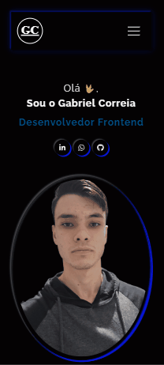

# Meu Portfólio

## Visão Geral

### Descrição

Este portfólio centraliza minhas habilidades, experiências e evolução como desenvolvedor, destacando o uso de novas tecnologias e boas práticas. Será atualizado frequentemente, mantendo um registro contínuo do meu crescimento profissional e da incorporação de novas competências.

### Capturas de Tela

## Processo de Desenvolvimento

### Tecnologias Utilizadas

- **HTML5 Semântico**
- **CSS Custom Properties**
- **Mobile-first Workflow**
- **Flexbox**
- **React**
- **Styled Components**:
- **TypeScript**

### Links

- **Portfólio Online**: [Visualizar Portfólio](https://gabrielth58.github.io/Portfolio/)

## Autor

- **LinkedIn**: [Gabriel Correia](https://www.linkedin.com/in/gabrielcorreia-dev)
- **WhatsApp**: [+55 (41) 9 9956-7727](tel:+5541999567727)
- **E-mail**: [gabrie.lcorreia@hotmail.com](mailto:gabrie.lcorreia@hotmail.com)
